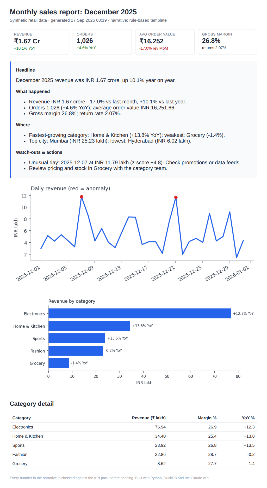
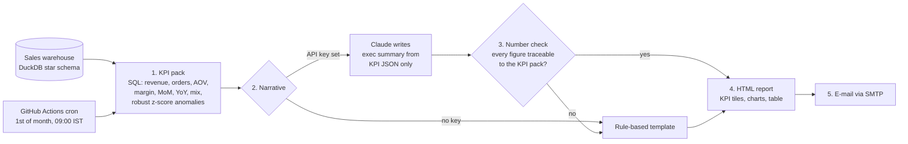

# AI Report Automation

**Monthly sales report that writes itself: SQL computes the KPIs, Claude writes the executive summary, every number in it is checked, and the report is e-mailed on a schedule.**

[](https://github.com/Shashan4321/ai-report-automation/actions/workflows/ci.yml)


> **Business problem.** Analysts lose hours every month copying numbers into slides and writing the same "revenue was up X%" commentary. This pipeline produces the KPI pack, a leadership-ready narrative and a clean HTML report, then e-mails it on the 1st of every month with no manual steps.

| | |
|---|---|
| **Stack** | Python · DuckDB SQL · Claude API · Jinja2 · Matplotlib · SMTP · GitHub Actions (cron) · pytest |
| **Skills shown** | KPI design · MIS automation · LLM grounding & guardrails · anomaly detection · report design · scheduling & secrets management |
| **Output** | [Sample report (HTML)](samples/sales_report_2025-12.html) · [KPI pack (JSON)](samples/kpis_2025-12.json) · [narrative](samples/narrative_2025-12.md) |



## How it works



**Why the number check matters.** LLMs can invent figures. The narrative is only sent if every number in it can be traced to the KPI pack (allowing for crore/lakh conversions). Otherwise the pipeline falls back to the deterministic template, so an executive never sees a made-up number. A test feeds a fake "Revenue jumped 99.9%" and asserts the fallback.

## In this project

Numbers from the committed sample run (December 2025, seeded synthetic data):

| KPI | Value |
|---|---|
| Revenue | ₹1.67 crore (+10.1% YoY, -17.0% MoM after the October-November festive peak) |
| Orders / AOV | 1,026 orders (+4.6% YoY) · ₹16,251.66 |
| Gross margin / returns | 26.8% · 2.07% |
| Anomalies flagged | 2 days (z-score +4.8 and +4.7) |
| Tests | 8 (KPI consistency, number check, LLM fallback, anomaly detection, mailer dry-run) |

## Quick start

```bash
git clone https://github.com/Shashan4321/ai-report-automation.git
cd ai-report-automation
pip install -r requirements-dev.txt
make report      # builds out/sales_report_2025-12.html (template narrative, no key needed)
make test

cp .env.example .env   # add ANTHROPIC_API_KEY (+ SMTP settings to send e-mail)
PYTHONPATH=src python -m reportbot.cli --month 2025-11
```

### Schedule it

1. Add repository secrets: `ANTHROPIC_API_KEY`, `SMTP_HOST`, `SMTP_USER`, `SMTP_PASSWORD` (an app password), `REPORT_TO`.
2. [`monthly-report.yml`](.github/workflows/monthly-report.yml) runs at 09:00 IST on the 1st, or on demand from the *Actions* tab. The report is also saved as a build artifact.
3. Without SMTP secrets the job runs in dry-run mode and still produces the artifact.

## Project structure

```text
├── src/reportbot/
│   ├── warehouse.py            # seeded synthetic star schema
│   ├── kpis.py                 # SQL KPI pack + robust anomaly detection
│   ├── narrative.py            # Claude prompt, template fallback, number check
│   ├── report.py               # charts + Jinja2 HTML
│   ├── templates/report.html.j2
│   ├── mailer.py               # SMTP with dry-run default
│   └── cli.py
├── samples/                    # committed output of a real run
├── tests/
└── .github/workflows/          # ci.yml + monthly-report.yml (cron)
```

## Data & license

* **Data:** synthetic retail sales generated with NumPy (seed 42), shared with [nl-to-sql-analytics-agent](https://github.com/Shashan4321/nl-to-sql-analytics-agent). No employer or client data is used.
* **Code:** MIT License. No secrets are committed; see `.env.example`.

## Author

**Shashank Singh**, Senior Data Analyst · [Portfolio](https://shashan4321.github.io) · [LinkedIn](https://www.linkedin.com/in/shashank-moon)

*Professional impact:* automated 15+ weekly/monthly MIS reports (10+ hours saved per week) and used Claude to generate reports and scheduled e-mails at work. This repo rebuilds that pattern in the open.
